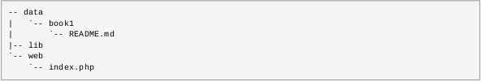
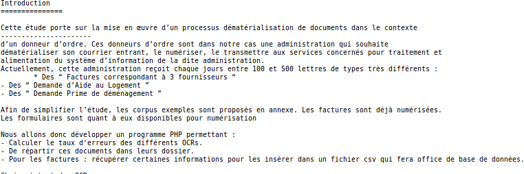
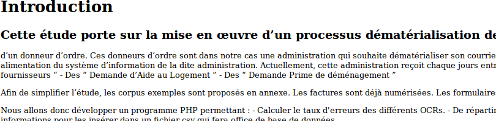

Silex-md-html-epub
============

Silex-md-html-epub v1 23 Mars 2015

by Ivance Kevin
Professor : Demko Christophe

- [Introduction](#introduction)
- [Affichagemd](#affichagemd)
- [Affichagehtml](#affichagehtml)
- [LivreEpub](#livreepub)
	- [LivreElectronique](#livreelectronique)
	
## Introduction
L' ensemble des exercices va nous conduire à créer dynamiquement des livres au format [epub](http://www.idpf.org/epub/20/spec/OPF_2.0_latest.htm) à partir de fichier écrits au format markdown. Le format [markdown](http://fr.wikipedia.org/wiki/Markdown) a été inventé conjointement par :
- [John Gruber](http://fr.wikipedia.org/wiki/John_Gruber) , célèbre blogueur américain du site [http://daringfireball.net](http://daringfireball.net).
-  [Aaron Swartz](http://fr.wikipedia.org/wiki/Aaron_Swartz) , informaticien et militant de l'internet, luttant notamment contre les lois PIPA/SOPA américaines, décédé en janvier 2013 par suicide. Ce projet pédagogique veut aussi lui rendre hommage.

Notre projet utilisera
-  un server internet qui sera PHP à l'aide de cette commande :
```
	php -S localhost:8000
```
- le micro-framework [silex](http://silex.sensiolabs.org) pour la redirection des URL
- la librairie [PHP Markdown](PHP Markdown) pour la transformation des fichiers au format markdown vers le format html.
- la librairie [Yaml](https://github.com/symfony/Yaml) du projet symfony pour l'analyse des méta-informations du livre électronique.
- un (des) fichier(s) xslt pour la transformation de fichiers html.

Pour valider nos livres électroniques construits, on a utilisé  le [validateur](http://validator.idpf.org) de fichiers epub.


## Affichagemd

Cette partie consiste à écrire un ensemble de fichiers PHP permettant d'afficher des fichiers au format markdown ayant comme extension .md

La structure du projet est la suivante : 



- Le fichier **web/index.php** est le point d'entrée de votre serveur, il sera écrit en utilisant la librairie
silex et la librairie PHP markdown.
- Le dossier lib servira à stocker le code des librairies que vous utiliserez.
- Les dossiers situés dans le dossier data contiendront les fichiers sources au format markdown.

Pour affichier des URL de la forme **http://localhost:8000/{book}.md** dont le **{book}** est un dossier existant dans le dossier **data**.
L'affichage de cette URL a pour but d'afficher le contenu du fichier **README.md** situé à l'intérieur de ce dossier

Exemple : 
	```
	http://localhost:8000/index.php/book1.md
	```

Il devrait affichier le contenu du fichier **data/book1/README.md**



Code associé

```
	$app->get('/{book}.md', function (Silex\Application $app, $book) {  
  if (file_exists('../data/'.$book) && file_exists('../data/'.$book.'/README.md') ) {
    $text = file_get_contents('../data/'. $app->escape($book).'/README.md');
  } else {
     $app->abort(404, "Le bouquin $book est introuvable.");
  } 
  return '<pre>'.$text.'</pre>';
});
```

**$app** :  On utilise l'application Silex pour la redirection des livres par son nom pour l'afficher en MarkDown 

**$book** : On récupère le nom du fichier md taper dans l'url ({book})

On vérifie si le **nom du livre** (le nom du dossier) existe dans le dossier **data/** et si dans le dossier du livre il existe un fichier **README.md** 
Si ce n'est pas le cas l'application retournera une page 404. 

Si c'est le cas il affichera le livre en format md.

## Affichagehtml

Pour affichier des URL de la forme **http://localhost:8000/{book}.html** dont le **{book}** est un dossier existant dans le dossier **data**.
L'affichage de cette URL a pour but d'afficher le contenu du fichier **README.md** situé à l'intérieur de ce dossier
Pour l'afficher en html, nous allons le convertir en utilisant la librairie PHP Markdown sur le fichier README.md.

Exemple : 
	```
	http://localhost:8000/index.php/book1.html
	```

Il devrait affichier le contenu du fichier **data/book1/README.md**



Code associé

```
$app->get('/{book}.html', function (Silex\Application $app, $book) {
  if (file_exists('../data/'.$book) && file_exists('../data/'.$book.'/README.md') ) {
    $text = file_get_contents('../data/'.$book.'/README.md');
    $html = Markdown::defaultTransform($text);
  } else {
    $app->abort(404, "Le bouquin $book est introuvable.");
  }
  return  $html;
});
```

**$app** :  On utilise l'application Silex pour la redirection des livres par son nom pour l'afficher en html  

**$book** : On récupère le nom du fichier html taper dans l'url ({book})

On vérifie si le **nom du livre** (le nom du dossier) existe dans le dossier **data/** et si dans le dossier du livre il existe un fichier **README.md** 
Si ce n'est pas le cas l'application retournera une page 404. 

Si c'est le cas on utilise la librairie PHP Markdown pour le transformer en format **html** et l'afficher.

## LivreEpub
## LivreElectronique

Pour télécharger le fichier le livre en format epub il faudra taper  l'URL de la forme **http://localhost:8000/{book}.html** dont le **{book}** est un dossier existant dans le dossier **data**.

L'affichage de cette URL a pour but de vous permettre de télécharger le fichier **README.md** convertit en format epub.
Ca vous permettra de l'ajouter dans l'un de vos logiciels préférés de bibliothèque Ebooks

Exemple : 
	```
	http://localhost:8000/index.php/book1.epub
	```
